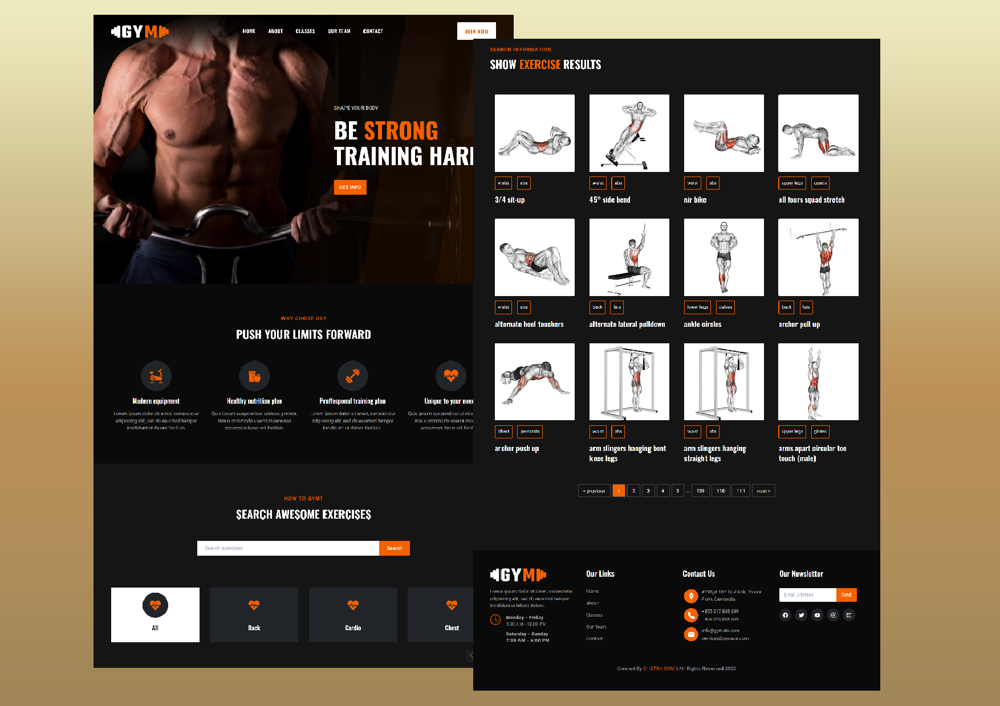

## Project Name: Gym Fitness Tracker
### About the project
**Gym Fitness Tracker** Website is an online mode exercise website where anyone can learn all type of workout exercise like biceps, triceps, back, shoulders, abs, etc. There is no need of any Trainer to learn any workout exercise. In that website anyone can learn with the help of gif in which it shows that how to do exercise with correct position. If anyone click on gif it renders to you with similar equipment exercises and some related youtube videos link to learn easily.
### Tech stack
- React.js
- Rapid API
- TailwindCSS
- React-router
- Swiperjs
- more...

### Features
- Responsive Gym Fitness Tracker Website Using TailwindCSS
- Compatible with all mobile devices and with a beautiful and pleasant user interface.
- Choose exercise categories and specific muscle groups
- Search browse more than one thousand exercises
- Pagination
- Exercise details
- Pull related videos from youtube
- Display similar exercises

👉 Live Demo: <a href='https://gym-fitness-tracker.vercel.app/'>Gym Fitness Tracker Demo</a>

### Screenshots of the Project

  

<!-- 

  <h2 align="center">Gymate - React Fitness Exercises Application</h2>

  - Includes: choose exercises categories and specific muscle groups
  - Includes: browse more than 1000 exercises
  - Includes: exercises pagination .

  <a href="https://codewithsadee.github.io/fitlife/"><strong>➥ Live Demo</strong></a>

 

### Demo Screeshots

 -->